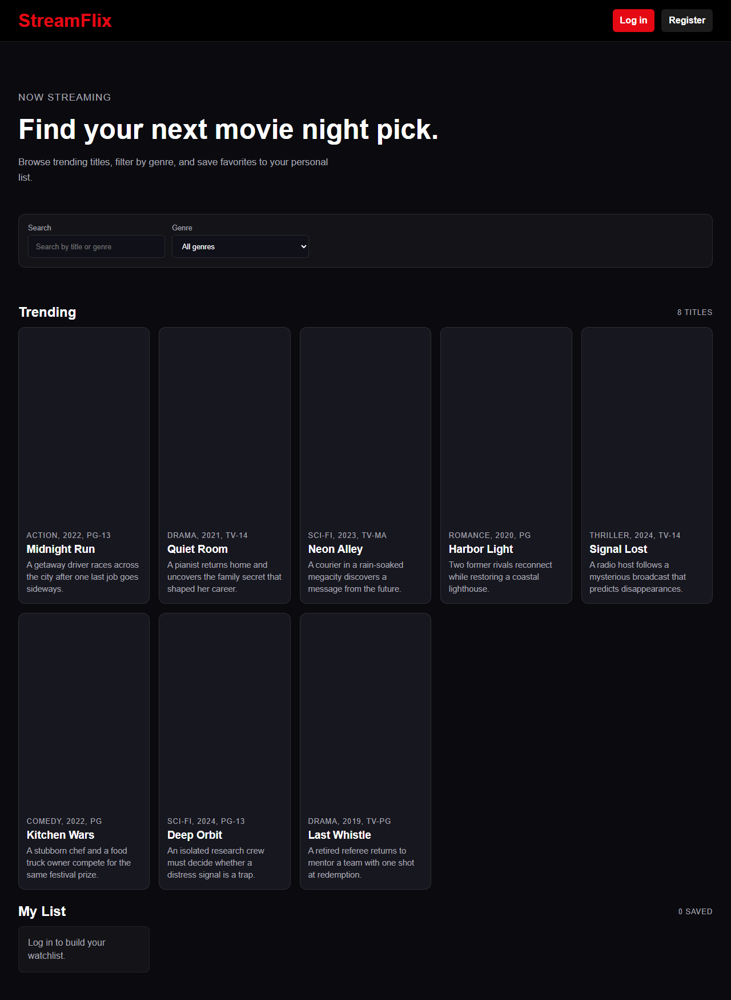
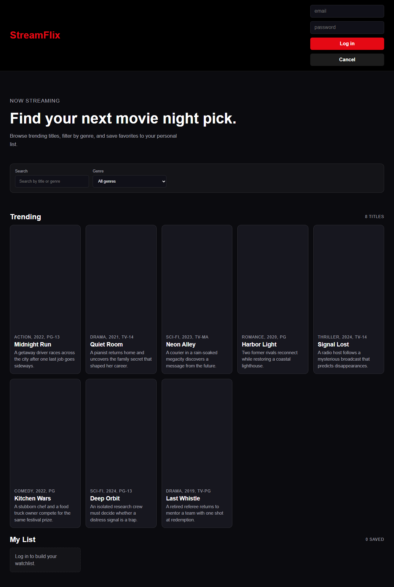

# StreamFlix

**Built:** January 2026  
**Author:** [Panashe Sanyanga](https://github.com/code-by-panashe-sanyanga)

A movie browsing web app I built while learning how a frontend talks to a backend API. You can browse films, search and filter by genre, register an account, log in, and save titles to a personal watchlist. It runs locally on your machine — this is a student learning project, not production software.

---

## What this project does

StreamFlix is split into two parts:

1. **Backend (Express API on port 4000)** — serves movie data, handles registration and login, and stores each user’s watchlist.
2. **Frontend (static site on port 3000)** — shows movie cards, search/filter controls, login forms, and buttons to add or remove films from “My List”.

When you log in, the API returns a JWT token. The frontend saves it in `localStorage` so you stay logged in after a refresh. Watchlist routes need that token in the `Authorization` header.

You can browse movies without an account. Saving to a watchlist requires login.

---

## Why I chose each technology

| Technology | Why I used it |
|------------|---------------|
| **Node.js + Express** | I wanted to practise building a REST API in JavaScript. Express is small, well documented, and easy to set up for routes like `/api/movies` and `/api/login`. |
| **Vanilla HTML/CSS/JS** | No React or build step — I could focus on `fetch`, DOM updates, and how the browser calls an API. |
| **JWT + bcryptjs** | JWT lets the server know who is logged in without storing sessions. bcrypt hashes passwords so they are not stored in plain text. |
| **movies.json** | A simple file was enough for a fixed catalogue. I did not want to set up a database for my first API project. |
| **CORS** | The frontend and API run on different ports, so the browser blocks requests unless CORS is enabled on the server. |
| **npx serve** | Quick way to serve the frontend folder without extra config. |

---

## Folder structure

```
StreamFlix/
├── backend/
│   ├── server.js          # Express API (movies, auth, watchlist)
│   ├── movies.json        # Movie catalogue (read at startup)
│   ├── package.json       # npm dependencies and start script
│   └── package-lock.json  # Locked dependency versions
├── frontend/
│   ├── index.html         # Page layout and sections
│   ├── style.css          # Dark Netflix-style theme
│   └── app.js             # Fetches API, renders cards, handles auth
├── docs/
│   └── screenshots/       # README images
│       ├── homepage.png
│       └── login-form.png
├── .gitignore
└── README.md
```

---

## How to run it

### Prerequisites

- [Node.js](https://nodejs.org/) 18 or newer

### Step 1 — Start the API

```bash
cd backend
npm install
npm start
```

The API runs at **http://localhost:4000**.  
Check it works: open **http://localhost:4000/api/health** — you should see JSON with `"ok": true`.

### Step 2 — Start the frontend

Open a **second terminal**:

```bash
cd frontend
npx serve .
```

Open the URL shown in the terminal (usually **http://localhost:3000**).

### Optional — custom JWT secret

```powershell
# Windows PowerShell
$env:JWT_SECRET="your-secret-here"
npm start
```

Default secret is `streamflix-dev-secret` (fine for local use only).

---

## Frontend files in detail

| File | What it does |
|------|----------------|
| **index.html** | Main page structure: header with search and genre filter, movie grid, auth panel (login/register), watchlist section, and status message area. |
| **style.css** | Dark theme, responsive card grid, button styles, active states for selected genre and watchlist items. |
| **app.js** | All client logic. Defines `API = 'http://localhost:4000'`, helper `api()` for authenticated `fetch` calls, loads movies and watchlist on start, renders filtered cards, handles register/login/logout, toggles watchlist add/remove, and persists the JWT in `localStorage` under `sf_token`. |

The frontend never reads `movies.json` directly — it always goes through the API.

---

## Backend files in detail

| File | What it does |
|------|----------------|
| **server.js** | Creates the Express app, enables CORS and JSON body parsing, loads `movies.json` once at startup, keeps `users` and `watchlists` in memory, and defines all `/api/*` routes. Uses `bcrypt` on register and `jwt.sign` on login. Middleware on watchlist routes verifies the Bearer token. |
| **package.json** | Lists dependencies (`express`, `cors`, `bcryptjs`, `jsonwebtoken`) and the `npm start` script that runs `node server.js`. |
| **package-lock.json** | Records exact versions npm installed so `npm install` is reproducible on another machine. |

### API routes

| Method | Endpoint | Auth | Description |
|--------|----------|------|-------------|
| `GET` | `/api/health` | No | Health check |
| `GET` | `/api/movies` | No | List all movies |
| `POST` | `/api/register` | No | Create account (`email`, `password`) |
| `POST` | `/api/login` | No | Log in, returns JWT |
| `GET` | `/api/watchlist` | Yes | Get saved movies |
| `POST` | `/api/watchlist/:id` | Yes | Add movie to watchlist |
| `DELETE` | `/api/watchlist/:id` | Yes | Remove movie from watchlist |

Protected routes expect: `Authorization: Bearer <token>`

---

## movies.json — why it exists

`movies.json` holds the full movie catalogue as an array of objects. Each movie has:

- `id`, `title`, `genre`, `year`, `rating`, `description`, `poster`

The server reads this file **once** when it starts (`fs.readFileSync`). That means:

- You can add or edit movies by changing the JSON file and restarting the backend.
- No database setup is required for a demo catalogue.
- Poster URLs point at placeholder images (`placehold.co`) so the UI works without hosting real artwork.

This is a deliberate trade-off: simple for learning, but not how a real streaming service would store millions of titles.

---

## node_modules — why it should not be uploaded

When you run `npm install` in `backend/`, npm downloads packages into a `node_modules/` folder. That folder:

- Is **large** (thousands of files).
- Is **recreated** from `package.json` and `package-lock.json` on any machine.
- Should stay **out of Git** — it is listed in `.gitignore`.

**Upload to GitHub:** source code, `package.json`, `package-lock.json`.  
**Do not upload:** `node_modules/`.

Anyone who clones the repo runs `npm install` once to get the same dependencies locally.

---

## Screenshots





---

## Limitations and possible improvements

**Current limitations**

- User accounts and watchlists live **in memory** — everything is lost when you restart the backend.
- No password reset, email verification, or profile pages.
- Movie posters are placeholders, not real artwork.
- Frontend and API must both be running; there is no single combined deploy script.
- Not hardened for production (default JWT secret, no rate limiting).

**Ideas for later**

- Store users and watchlists in SQLite or PostgreSQL.
- Add refresh tokens and proper environment-based secrets.
- Replace `movies.json` with a database or external movie API.
- Build the frontend with Vite/React once comfortable with the vanilla version.
- Docker Compose to start API + frontend with one command.

---

## Troubleshooting

| Problem | What to try |
|---------|-------------|
| **Blank movie grid / “Failed to fetch”** | Make sure the backend is running on port 4000 before opening the frontend. Check **http://localhost:4000/api/health**. |
| **CORS errors in the browser console** | Backend must be started with `npm start` from `backend/` (CORS is enabled in `server.js`). Do not open `index.html` as a `file://` URL — use `npx serve`. |
| **Login works but watchlist is empty after restart** | Expected — watchlists are in-memory only until you add a database. |
| **“user exists” on register** | That email was already registered in the current server session. Restarting the server clears all users. |
| **Port already in use** | Another app is using 4000 or 3000. Stop it or change the port in `server.js` / `serve` options. |
| **`npm install` fails** | Confirm Node 18+ with `node -v`. Delete `node_modules` and run `npm install` again. |

---

## Links

- [Portfolio](https://github.com/code-by-panashe-sanyanga/PS-PORTFOLIO)
- [GitHub profile](https://github.com/code-by-panashe-sanyanga)
